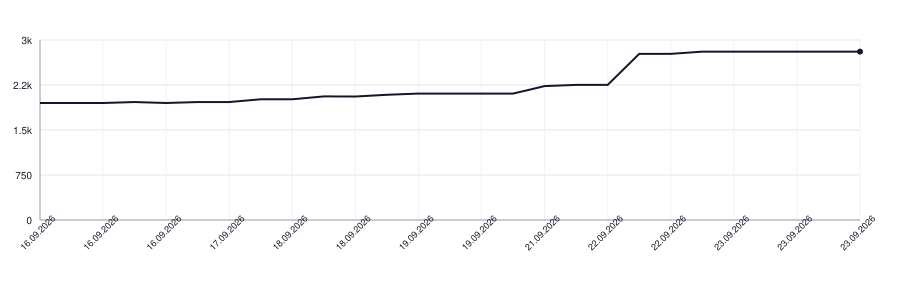

# wikilayer-client-kotlin

[](https://github.com/wikilayer/wikilayer-client-kotlin/actions/workflows/tests.yml)
[](https://github.com/wikilayer/wikilayer-client-kotlin/actions/workflows/documentation.yml)

The Kotlin/Android client for Wikilayer's API. It is a port of
[wikilayer-client-swift](https://github.com/wikilayer/wikilayer-client-swift),
which leads the shared behavior.

The library owns its primary server and ordered mirrors in `hosts.yaml`. An app
uses the bundled configuration instead of copying host addresses into its own
configuration:

```kotlin
val hosts = WikiHostConfiguration.bundled.pool()
val api = WikiApi(hosts)
```

Safe reads fail over after network errors or configured HTTP statuses (451 by
default). A safe preflight chooses a reachable host before the app obtains a
one-use provider token. Identity tokens, OAuth authorization codes, and sign-out
requests are never replayed against another host.

## Taking it

The library is published from GitHub releases through JitPack:

```kotlin
repositories { maven("https://jitpack.io") }

dependencies {
    implementation("com.github.wikilayer:wikilayer-client-kotlin:0.1.0")
}
```

## Documentation

The [Dokka API reference](https://wikilayer.github.io/wikilayer-client-kotlin/)
is generated from the public Kotlin API and deployed by GitHub Actions.

## Development

```sh
make test-build
make test
make lint
make docs
make build
```

## License

MIT.

## Lines of Code

<picture>
  <source media="(prefers-color-scheme: dark)" srcset=".github/loc-history-dark.svg">
  <source media="(prefers-color-scheme: light)" srcset=".github/loc-history-light.svg">
  
</picture>
